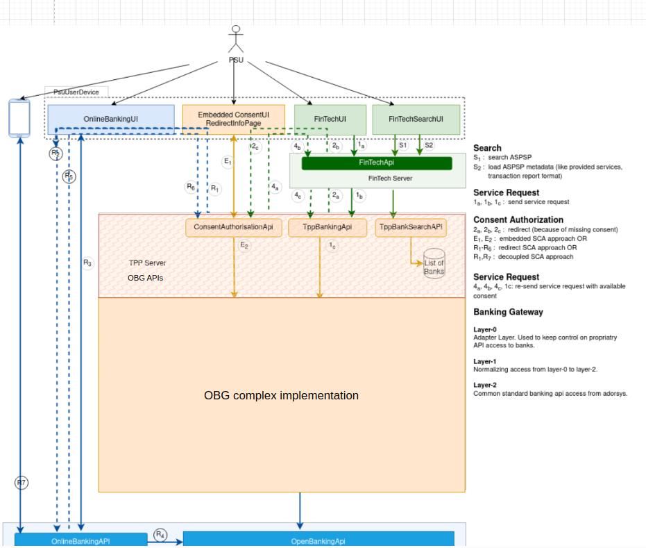

# FintechAPI PIS flow Documentation

## 1. Overview
  
  This document provides details on how Fintech API is used in the Payment Initiation Flow
---

## 2. Understanding the Payment Initiation Service in XS2A

The Payment Initiation Service (PIS) in XS2A (Access to Account) allows third-party providers (TPPs) to initiate payments on behalf of a user directly from their bank account.  

### Key Components in XS2A Payment Initiation:

- **Fintech**:  
  Entity that provides an app (mobile/web) to the PSU for them to initiate the payment (note that in some cases, the Fintech can also be the TPP).
- **TPP (Third-Party Provider)**:  
  A licensed entity that interacts with the bank's API to initiate payments.
- **PSU (Payment Service User)**:  
  The end-user who initiates the payment via a fintech/TPP app.
- **ASPSP (Account Servicing Payment Service Provider)**:  
  The bank or financial institution holding the payer’s account.
- **SCA (Strong Customer Authentication)**:  
  A security mechanism required for user authentication.

---

## 3. API Description

 - **Overview**: This API provides Fintechs with the capability to perform payment initiation calls to the PSU's bank.To communicate with the OpenBankingGateway a fintech UI need to communicate with a fintechAPI on the fintechServer side that will forwards the request to the OPG API described [here]([https://github.com/adorsys/open-banking-gateway/blob/develop/opba-banking-rest-api-ymls/src/main/resources/static/tpp_banking_api_ais.yml](https://github.com/ADORSYS-GIS/taler-obg/blob/main/docs/obg/Open%20Banking%20Gateway%20-%20PIS%20Flow%20Documentation.md)).
 - **Consumers**: FintechUI   
Let see some of the endpoints related to the PIS flow that we are having :  

### a. FinTechAuthorization 

#### i. **POST v1/login**

Simple login interface used to establish a session between PSU and FinTech. Real application will delegate login to an oAuth2 Identity provider.

**- Request Header:**

- `X-Request-ID `: Unique ID that identifies this request through common workflow. Must be contained in HTTP Response as well..

**- Request Body:**

- `Login request`: Just a combination of the username and the password  
Example value  
```
{ "username":"string"
  "password": "string"
}
```

**- Response Header:**

- `X-Request-ID`: Unique ID that identifies this request.
- `Set-Cookie`: SessionCookie used to maintain the login session between the FinTechUI and the FinTechApi. This cookie is validated using an X-XSRF-TOKEN sent with the request header. This cookie must contain a hash reference to the corresponding XSRF-TOKEN -> hash(XSRF-TOKEN). So in order to verify that the request originate from the FinTechUI application, a server component will hash the given XSRF-TOKEN and compare it with the result in the cookie.
Remember that the XSRF-TOKEN value must be extracted from the request parameter named X-XSRF-TOKEN and not from a cookie header. This is important to mention as some implementation might return the XSRF-TOKEN to the FinTechUI in form of a cookie.  
- `X-XSRF-TOKEN`: XSRF parameter used to validate a SessionCookie. This token is produced by the FinTechAPI by either Storing a hash value of the XSRF-TOKEN in the SessionCookie or
Using the XSRF-TOKEN to encrypt the content of the SessionCookie. The XSRF-TOKEN is returned to the FinTechUI as a response header with the header value X-XSRF-TOKEN. It is the responsibility of the FinTechUI will take care of ensuring the persistence of the XSRF-TOKEN.  

**- Response body:**

- `200 code`: The user profile object. Contains information needed to present some sort of dashboard to the user.
  ```
    {
  "userProfile": {
    "name": "string",
    "lastLogin": "2025-03-21T09:18:56.963Z"
  }
  }
  ```
- `401 code`: Access credentials absent or invalid. This happens when

  - Provided credential for login not matching.
  - Endpoint expect a session cookie but none is present.
  - Session cookie is present but associated stateString does not match.  
As a consequence, we reset existing FinTechLoginSessionState if any. Nevertheless we do not reset RedirectSessionCookie.
```
{
  "sessionState": "string",
  "psuMessages": [
    {
      "category": "ERROR",
      "code": "string",
      "path": "string",
      "text": "string"
    }
  ]
}
```


#### ii. **GET v1/login/oauth2**

Oauth2 callback to authenticate user using some Oauth2 identity provider account. Provider id is set inside state.

**- Query Parameter:**

  - `code` (string): OAuth2 redirect code
  - `state` (string): OAuth2 redirect state
  - `scope` (string): OAuth2 requested scope
  - `error` (string): OAuth2 error

**- Response Header:**

- `X-Request-ID` (string): Unique ID that identifies this request through common workflow.
- `Set-Cookie` (string): SessionCookie used to maintain the login session between the FinTechUI and the FinTechApi. This cookie is validated using an X-XSRF-TOKEN sent with the request header. This cookie must contain a hash reference to the corresponding XSRF-TOKEN -> hash(XSRF-TOKEN). So in order to verify that the request originate from the FinTechUI application, a server component will hash the given XSRF-TOKEN and compare it with the result in the cookie.
Remember that the XSRF-TOKEN value must be extracted from the request parameter named X-XSRF-TOKEN and not from a cookie header. This is important to mention as some implementation might return the XSRF-TOKEN to the FinTechUI in form of a cookie.
- `X-XSRF-TOKEN`: XSRF parameter used to validate a SessionCookie. This token is produced by the FinTechAPI by either Storing a hash value of the XSRF-TOKEN in the SessionCookie or
Using the XSRF-TOKEN to encrypt the content of the SessionCookie. The XSRF-TOKEN is returned to the FinTechUI as a response header with the header value X-XSRF-TOKEN. It is the responsibility of the FinTechUI will take care of ensuring the persistence of the XSRF-TOKEN.
**- Response Body:**

- `200 code`: The user profile object. Contains information needed to present some sort of dashboard to the user.
  ```
    {
  "userProfile": {
    "name": "string",
    "lastLogin": "2025-03-21T09:18:56.963Z"
  }
  }
  ```
- `401 code`: Access credentials absent or invalid. This happens when

  - Provided credential for login not matching.
  - Endpoint expect a session cookie but none is present.
  - Session cookie is present but associated stateString does not match.  
As a consequence, we reset existing FinTechLoginSessionState if any. Nevertheless we do not reset RedirectSessionCookie.
```
{
  "sessionState": "string",
  "psuMessages": [
    {
      "category": "ERROR",
      "code": "string",
      "path": "string",
      "text": "string"
    }
  ]
}
```

#### iii. **POST v1/logout**

If user can be authenticated, user will be logged out.

**- Request header:**

  - `X-Request-ID` (string): Unique ID that identifies this request through common workflow. Must be contained in HTTP Response as well.
  - `X-XSRF-TOKEN` (string): XSRF parameter used to validate a SessionCookie or RedirectCookie.

**- Response Body:**

- `200 code`: Nothing returned.
- `401 code`: 
   ```
      {
    "sessionState": "string",
    "psuMessages": [
      {
        "category": "ERROR",
        "code": "string",
        "path": "string",
        "text": "string"
      }
    ]
  }
  ```
   
**- Response header:** (just in case of a 401 code response)
  - `X-Request-ID` (string): Unique ID that identifies this request through common workflow.
  - `Set-Cookie` (string): Delete all relevant cookies

#### iv. **GET v1/{auth-id}/fromConsent/{ok-or-notok}**

Entry point when PSU is redirected back from ConsentAuthorisationApi to the FinTechUI.

**- Path Parameter:**

  - `{redirectCode}` (string): Unique ID identifying the service session.
  - `{ok-or-notok}` (string): Available_values: OK, NOT_OK.

**- Query Parameter:**

  - `{auth-id}` (string): Unique ID identifying the service session.

**- Request Header:**

   - `X-XSRF-TOKEN` (string): XSRF parameter used to validate a SessionCookie or RedirectCookie.
   - `X-Request-ID` (string): Unique ID identifying the request.

**- Response header** (in case of a 202 response code)
    - `Location` (string): Entry point for loading the FinTechUI. This is generaly invoked when another application redirects an authenticated user to the FinTechUI. The FinTechUI after a reload must load the xsrfToken from the localStorage and invoke the /v1/{auth-id}/fromConsent/{ok-or-notok} endpoint of the FinTechAPI.
    - `X-Request-ID` (string): Unique ID that identifies this request through common workflow.
    - `X-XSRF-TOKEN` (string): XSRF parameter used to validate a SessionCookie. The XSRF-TOKEN is returned to the FinTechUI as a response header with the header value X-XSRF-TOKEN. It is the responsibility of the FinTechUI will take care of ensuring the persistence of the XSRF-TOKEN.
    - `Set-Cookie` (string): SessionCookie used to maintain the login session between the FinTechUI and the FinTechApi. This cookie is validated using an X-XSRF-TOKEN sent with the request header. This cookie must contain a hash reference to the corresponding XSRF-TOKEN -> hash(XSRF-TOKEN). So in order to verify that the request originate from the FinTechUI application, a server component will hash the given XSRF-TOKEN and compare it with the result in the cookie. Remember that the XSRF-TOKEN value must be extracted from the request parameter named X-XSRF-TOKEN and not from a cookie header. This is important to mention as some implementation might return the XSRF-TOKEN to the FinTechUI in form of a cookie.
    
**- Response header** (in case of a 401 response code)
    - `X-Request-ID` (string): Unique ID that identifies this request through common workflow.
    - `Set-Cookie` (string): Delete all relevant cookies. Example value: "RedirectSession=null; Path=/; Max-Age=0, Session=null; Path=/; Max-Age=0"
    
**- Response header** (in case of a 404 response)
   - `X-XSRF-TOKEN` (string): XSRF parameter used to validate a SessionCookie or RedirectCookie.
   - `X-Request-ID` (string): Unique ID identifying the request.
   - `Set-cookie` (string): describe above.

**- Response body** (in case of a 401 response code):Access credentials absent or invalid. This happens when

   - Provided credential for login not matching.
   - Endpoint expect a session cookie but none is present.
   - Session cookie is present but associated stateString does not match.
  As a consequence, we reset existing FinTechLoginSessionState if any. Nevertheless we do not reset RedirectSessionCookie.
  ```
{
  "sessionState": "string",
  "psuMessages": [
    {
      "category": "ERROR",
      "code": "string",
      "path": "string",
      "text": "string"
    }
  ]
}
  ```
    
**- Response body** (in case of a 404 response code): The specified resource was not found
  ```
{
  "sessionState": "string",
  "psuMessages": [
    {
      "category": "ERROR",
      "code": "string",
      "path": "string",
      "text": "string"
    }
  ]
}
  ```

#### v. **GET v1/{auth-id}/fromPayment/{ok-or-notok}

Entry point when PSU is redirected back from ConsentAuthorisationApi to the FinTechUI. All the informations are the same as above.

### b. FintechBankSearch

#### i. GET /v1/search/bankSearch 

**- Query Parameter:**

   - `keyword` (string): The bank search input string
   - `start` (integer): The index of the first result
   - `max` (integer): The max number of entries to return with the response.
    
**- Request Header:**

   - `X-XSRF-TOKEN` (string): XSRF parameter used to validate a SessionCookie or RedirectCookie.
   - `X-Request-ID` (string): Unique ID identifying the request.

**- Response Header** (in case of a 200 response code)
   - `X-Request-ID` (string): same as above
   - `Set-Cookie` (string): same as above
   - `X-XSRF-TOKEN` (string): same as above
     
**- Response Header** (in case of a 401 response code)
   - `X-Request-ID` (string): same as above.
   - `Set-Cookie` (string): Delete all relevant cookies. Example: "RedirectSession=null; Path=/; Max-Age=0, Session=null; Path=/; Max-Age=0"

**- Response body** (in case of a 200 response code)
    ```
    {
  "bankDescriptor": [
    {
      "bankName": "string",
      "bic": "string",
      "bankCode": "string",
      "uuid": "3fa85f64-5717-4562-b3fc-2c963f66afa6",
      "profiles": [
        {
          "bankId": "string",
          "bankName": "string",
          "name": "string",
          "bic": "string",
          "uuid": "3fa85f64-5717-4562-b3fc-2c963f66afa6",
          "services": [
            "string"
          ],
          "externalId": "string",
          "externalInterfaces": "string",
          "protocolType": "string",
          "isSandbox": true
        }
      ]
    }
  ],
  "keyword": "string",
  "start": 0,
  "max": 0,
  "total": 0
}
    ```
**- Response body:** (in case of a 401 response code) Access credentials absent or invalid. This happens when
      - Provided credential for login not matching.
      - Endpoint expect a session cookie but none is present.
      - Session cookie is present but associated stateString does not match.  
    As a consequence, we reset existing FinTechLoginSessionState if any. Nevertheless we do not reset RedirectSessionCookie.

    ```
           {
        "sessionState": "string",
        "psuMessages": [
          {
            "category": "ERROR",
            "code": "string",
            "path": "string",
            "text": "string"
          }
        ]
      }
    ```


#### ii. GET /v1/search/bankSearch 

Request the profile of the bank identified with id (bankProfileId).

**- Request Header**
    - `X-Request-ID`: Unique ID that identifies this request through common workflow. Must be contained in HTTP Response as well.
    - `X-XSRF-TOKEN`: XSRF parameter used to validate a SessionCookie or RedirectCookie.

**- Query parameter** 
    - `bankProfileId`: Identifier of the bank to be loaded.
    
**- Response Header** (in case of a 200 or a 404 response code)
    - `X-Request-ID`: same as above
    - `Set-Cookie`: same as above
    - `X-XSRF-TOKEN`: same as above
    
**- Response Header:*** (in case of a 401 response code )
  - `X-Request-ID`: same as above
  - `Set-Cookie`: Delete all relevant cookies. Example: "RedirectSession=null; Path=/; Max-Age=0, Session=null; Path=/; Max-Age=0"

**- Response body** (in case of a 200 response code )
```
   {
  "bankProfile": {
    "bankId": "string",
    "bankName": "string",
    "name": "string",
    "bic": "string",
    "uuid": "3fa85f64-5717-4562-b3fc-2c963f66afa6",
    "services": [
      "string"
    ],
    "externalId": "string",
    "externalInterfaces": "string",
    "protocolType": "string",
    "isSandbox": true
  }
}
 ```

**- Response Body** (in case of a 401 response code): same as in the previous endpoint

**- Response Body** (in case of a 404 response code): 
   ```
[
  {
    "category": "ERROR",
    "code": "string",
    "path": "string",
    "text": "string"
  }
]
   ```

### c. FintechRetrieveAllSinglePayments

#### i. GET v1/pis/banks/{bank-id}/accounts/{account-id}/payments/single 

This method is used to get payment status.

**- Path parameter:**
   - `{bank-id}`: Identifier of the bank.
   - `{account-id}`: account identifier of the account from where the payment status will be check.

**- Request header:**
   - `X-Request-ID` (string): same as above.
   - `X-XSRF-TOKEN` (string): XSRF parameter used to validate a SessionCookie or RedirectCookie.

**- Response body:**(in case of a 200 response code) 	List of all payments done 
```
[
  {
    "endToEndIdentification": "string",
    "debtorAccount": {
      "iban": "FR7612345987650123456789014",
      "bban": "BARC12345612345678",
      "pan": "5409050000000000",
      "maskedPan": "123456xxxxxx1234",
      "msisdn": "+49 170 1234567",
      "currency": "EUR"
    },
    "instructedAmount": {
      "currency": "EUR",
      "amount": "123"
    },
    "creditorAccount": {
      "iban": "FR7612345987650123456789014",
      "bban": "BARC12345612345678",
      "pan": "5409050000000000",
      "maskedPan": "123456xxxxxx1234",
      "msisdn": "+49 170 1234567",
      "currency": "EUR"
    },
    "creditorAgent": "AAAADEBBXXX",
    "creditorName": "Creditor Name",
    "creditorAddress": {
      "street": "rue blue",
      "buildingnNumber": "89",
      "city": "Paris",
      "postalCode": "75000",
      "country": "FR"
    },
    "remittanceInformationUnstructured": "Ref Number Merchant",
    "transactionStatus": "string",
    "initiationDate": "2025-03-24"
  }
]	

```

**- Response header:** (in case of a 401 response) same as above. 
**- Response Body:** (in case of a 401 response) same as above.

### d. FintechSinglePaymentInitiation

#### i. POST v1/pis/banks/{bank-id}/accounts/{account-id}/payments/single 

This method is used to initiate a payment at the Fintech Server.

**- Query parameter:**
   - `{bank-id}`: same as above.
   - `{account-id}`: identifier of the account where the payment will be initiate from

**- Request header:**
   - `X-Request-ID ` (string): same as above
   - `X-XSRF-TOKEN ` (string): same as above
   - `X-Psu-Authentication-Required` (boolean): If false, login form to OPBA will not be displayed as there might be nothing to share for payments, so that authentication is not necessary. If absent or true - login form for payments will be displayed.
   - `Fintech-Redirect-URL-OK ` (string): Example https://example.com/myservice?auth-id=sf3x;authResult=success
   - `Fintech-Redirect-URL-NOK` (string): Example https://example.com/myservice?auth-id=sf3x;authResult=failure
   - `Fintech-Decoupled-Preferred` (boolean): If it equals "true", the fintech prefers a decoupled SCA approach.
   - `Fintech-Brand-Logging-Information` (string): URI for the Endpoint to which the status of the consent should be sent

**- Request body:**

```
{
  "name": "string",
  "creditorIban": "string",
  "debitorIban": "string",
  "amount": "string",
  "purpose": "string",
  "endToEndIdentification": "string",
  "instantPayment": true
}
```

**- Response header:** (in case of a response 202 ) it will redirect the UserAgent to the ConsentAuthorisationApi.
   -`Location`  (string): This is the 202 Location Header. It contains a redirect link for the /auth endpoint of the ConsentAuthorisationApi. This link must contain a redirectCode as a query parameter. Example: http://localhost:8083/consent/auth?redirectCode=ejxs.wersdzxxc23r.asdf
   - `X-Request-ID`
   - `X-XRSF-TOKEN`
   - `Set-Cookie`: set before redirecting PSU. Example: "RedirectSession=ejxs.wersdzxxc23r.asdf; Path=/"

**- Response header** (in case of a 401 response)


## 4. Detailed API Documentation

For detailed explanation about our APIs you can check those files:
- **[FintechAPI]([https://github.com/adorsys/open-banking-gateway/blob/develop/opba-banking-rest-api-ymls/src/main/resources/static/tpp_banking_api_ais.yml](https://github.com/adorsys/open-banking-gateway/blob/develop/fintech-examples/fintech-api/src/main/resources/static/fintech_api.yml))**
- **[CookieManagement]([https://github.com/adorsys/open-banking-gateway/blob/develop/opba-banking-rest-api-ymls/src/main/resources/static/tpp_banking_api_bank_search.yml](https://github.com/adorsys/open-banking-gateway/blob/develop/fintech-examples/CookieManagement.md))**

---

## 5. Authentication

Here we are using what we call SCA Approaches to ensure that the PSU is really the one that want to initiate the payment in our scenario. **SCA** stands for Strong Customer Authentication. In general we have 3 SCA approaches:
 - **Embedded approach**: When using the embedded approach, during the payment initiation transaction the PSU will his bank personal security credentials on the TPP/Fintech screen.
 - **Redirect approach**: When using this approach, the PSU will be redirect on the bank's side (e.g Online banking app) to enter his credentials and confirm the payment
 - **Decoupled approach**: Here the PSU will be sent to a separate secondary devince to authenticate during the payment initiation transaction

Those authentication mecanisms are managed inside the Online Banking Gateway project using the **[ConsentAuthorisationApi](#ConsentAuthorisationApi)**

---

## 6. Architecture and workflow

So in this section we will show a simplified architecture of the Open Banking Gateway and explain the workflow when it is come to Payment Initiation Service

.

In this picture all the green components represent a fintech application use by the PSU to initiate the payment.
In our scenario using our fintech-example when the PSU want to initiate a payment that is what is happening
- S1: On the fintech app the PSU will search and select his bank with a call that will go though the fintech API and reach the TPPBankSearchApi on the TPP side (our OBG API)
- 1a: The PSU will initiate a payment on the Fintech UI by providing all the informations we need to have (IBAN,instructed amount,etc...)
- 1b: The Fintech APi will carry informations gave by the PSU via the FintechAPI to the TPPBankingApi and initiate a payment via the ```/v1/banking/pis/payments/{payment-product}``` endpoint
- 1c: The OBG(on the TPP side) will go with the request to the ASPSP side
- 2a,2b,2c:  The consent authorization process is triggered by redirecting the PSU from the TppBankingApi (2a) over the FinTechApi (2b) to the ```/consent/{auth-id}``` entry point of this ConsentAuthorisationApi (2c).
- 4a,4b,4c: The final result of the authorization process is a PsuCosentSession that is returned by the token endpoint of the TppBankingAPi to the FinTechApi (4c). This handle will (PsuCosentSession) will be stored by the FinTechApi and added a PSU identifying information to each service request associated with this PSU.
